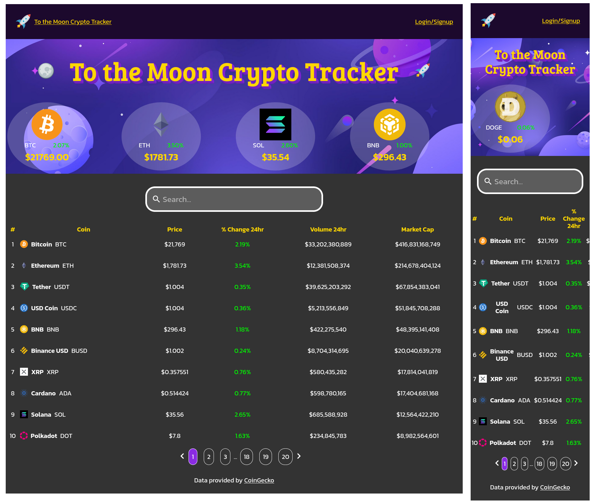
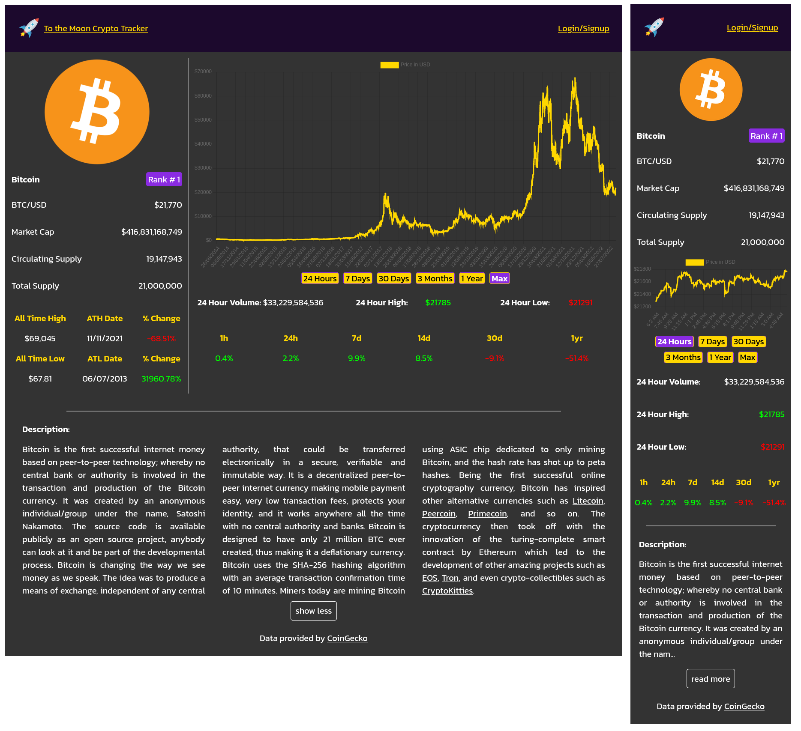

# To the Moon Crypto Tracker

## Welcome! 👋

Thanks for checking out this repository.

This is a cryptocurrency tracking app displaying price data for the top 200 cryptos as ranked by [CoinGecko](https://www.coingecko.com/).

## Contents

- [Overview](#overview)
  - [Links](#links)
  - [Screenshots](#screenshots)
- [My process](#my-process)
  - [Built with](#built-with)
  - [Hosting](#hosting)
  - [What I learned](#what-i-learned)
  - [Useful resources](#useful-resources)

## Overview

My aim was to practice fetching third party data and displaying it using the React libray. The cryptocurrency website [CoinGecko](https://www.coingecko.com/) provides API with comprehensive data for free and without the need for a key with the basic plan.

To the Moon Crypto Tracker fetches data on the top 200 ranked cryptocurrencies as ranked by CoinGecko and displays the name, rank, price etc on a home page with pagination as well as a page for each cryptocurrecny displaying more details including price chart.

### Links

Live site coming soon

### Screenshots

Homepage view



CoinPage view



## My Process

### Built with

I used the React framework to build the frontend of this project. It has the following dependencies:

- axios
- react-router-dom
- react-paginate
- chart.js
- reactchartjs-2
- react-alice-carousel
- dompurify
- date-fns
- react-icons

Styling was done with a custom CSS stylesheet and included the normalize stylesheet.

### Hosting

Planned for hosting on Firebase.

### What I learned

I got a lot out of builing this app and I am now more confident with React. It was my first practice of pagination, charts, carousel and sanitizing inner HTML with the help of npm packages.

However the biggest takeaway was how to display data from complex datasets with nested objects. For example, the market_cap is an object containing currencies (keys) and prices (values) nested in the market_data object. I found that React would not display the market cap and other values on page refresh if the varible was entered directly into the JSX element without chaining operators (.?) and ternary operators to check if the data contains the object and ignores it if it doesn't.

```js

<div className="coin__container">
    <p>Market Cap</p>
    {coin.market_data?.market_cap ? (
    <p>${coin.market_data.market_cap.usd.toLocaleString()}</p>
    ) : null}
</div>

```

### Useful resources

I always wanted to build a crypto price app using data and built this app myself from scratch. However, as I am learning React, used multiple sources to workout how to make specific components.

#### Tutorials that helped

To get started this tutorial by [Brian Design](https://www.youtube.com/watch?v=9ohK7CapmIs&t) helped give me the refresher I needed on getting data from APIs.

[Roadside Coder](https://www.youtube.com/watch?v=QA6oTpMZp84)'s tutorial and repo helped me implement the more complex components of the app and was also the inspiration for the overall layout.

I also studied the repo from the turorial by [Code Commerce](https://www.youtube.com/watch?v=gxXw-M5lDOw&t) to implement some of the features in this project.

To make the pagination component I followed this tutorial by [PedroTech](https://www.youtube.com/watch?v=HANSMtDy508).

The examples Chart-js 2 at [Educative](<https://www.educative.io/answers/how-to-use-chartjs-to-create-charts-in-react>) helped me figure out to to display a chart in this app.

#### Images

Moon image from [Stick PNG](http://www.stickpng.com/img/nature/moon/moon-clipart)

Rocket image from [Clipart World](https://clipart.world/rocket-clipart/rocket-clipart-transparent-background-7/)

Space background image from [FreePik](https://www.freepik.com/free-vector/cartoon-galaxy-background-with-planets_14121184.htm#query=space&position=18&from_view=keyword)
